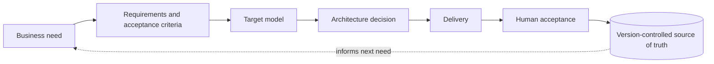
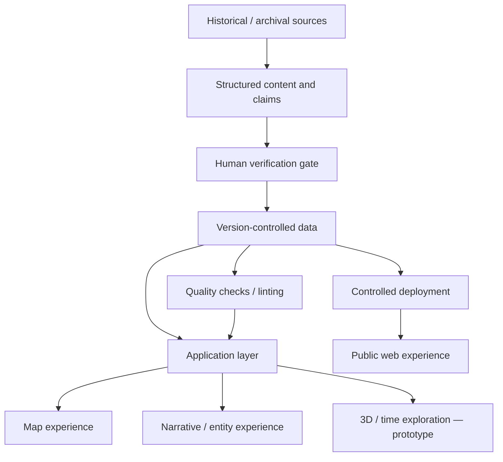
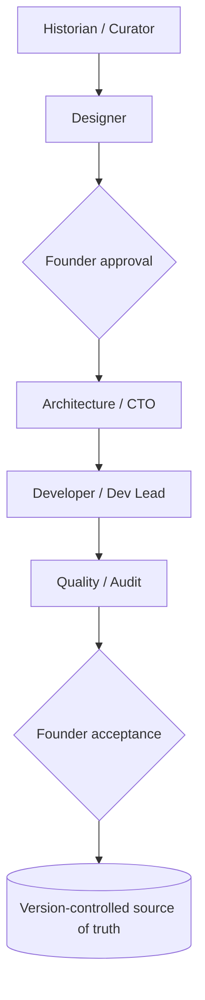
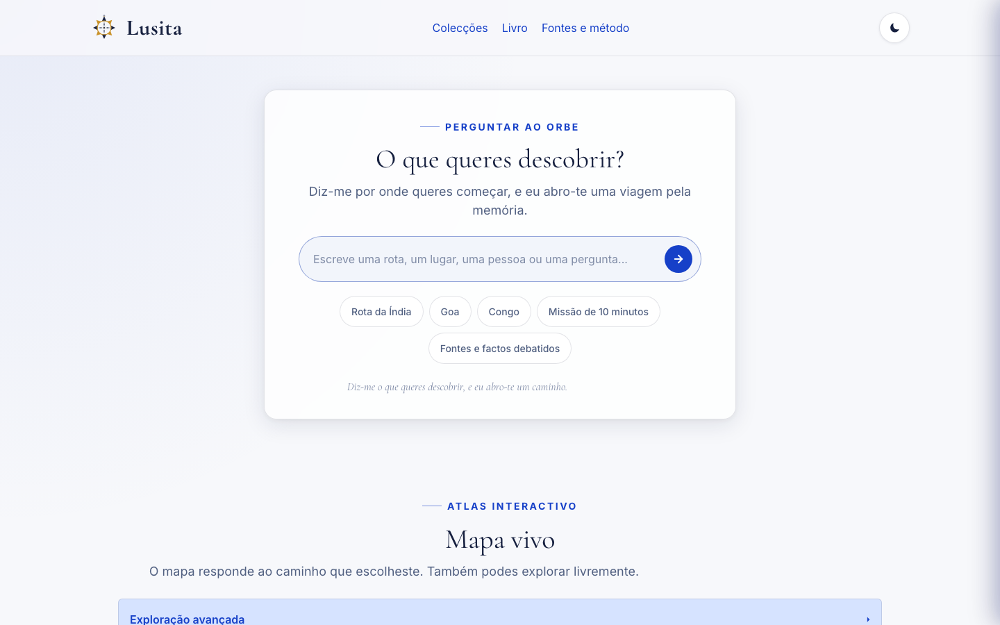
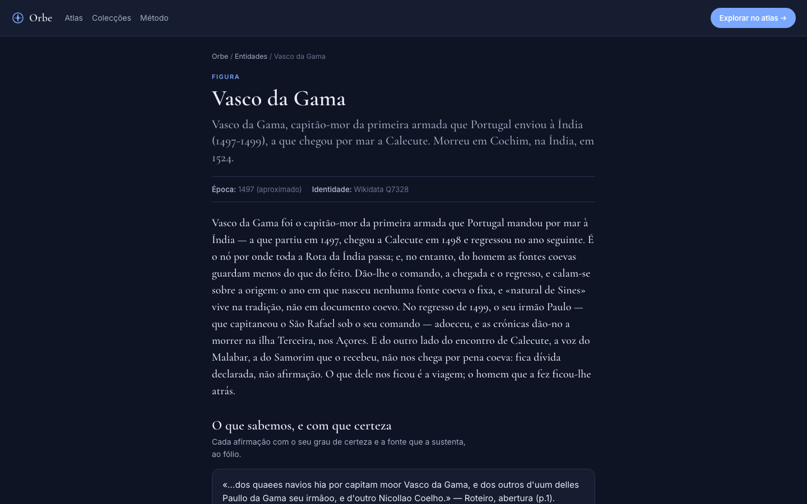
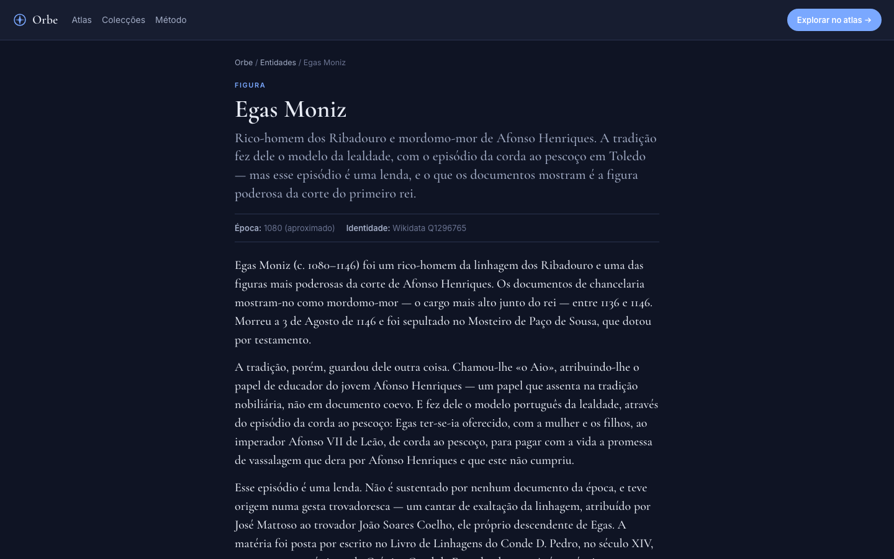

# Orbe da Memória

**AI-native cultural discovery platform — a source-first digital atlas.**

A digital atlas that turns *verified* historical material into interactive geographic and
narrative experiences. Orbe treats **provenance and verification as first-class product
capabilities**, not afterthoughts — every public claim is derived from structured data with a
recorded source and an explicit certainty grade.

| | |
|---|---|
| **Role** | Founder · Product Lead · Solution Design · Information Governance · AI Operating Model |
| **Status** | Live MVP, in active development |
| **Live** | https://lusita.io/orbe/ (public production site) |
| **Architecture** | Data-driven static web platform + geospatial experiences (3D exploration in prototype) |
| **Technical stack** | HTML · CSS · JavaScript · JSON · Leaflet · Git · GitHub (Three.js in prototype) |
| **AI model** | Human-in-the-loop · specialised AI agents · governed delivery |
| **Production repository** | Private |

> **This repository is a public architecture and product case study.**
> The production source code and datasets remain private. Everything here is documentation,
> diagrams, and purpose-built illustrative examples — no production source or proprietary data
> is included.

---

## 1 · The problem

Verified historical knowledge is abundant in archives and institutions, yet hard for the public
to *explore*. Three forces make this worse, not better:

- **Access.** Primary sources live in catalogues and reading rooms, not in navigable public experiences.
- **Trust.** Generative AI multiplies the *volume* of historical content without improving its *reliability* — plausible prose is not a verified claim.
- **Provenance.** Once a claim is separated from its source, its trustworthiness is unrecoverable.

Orbe's response is to make **verification and provenance part of the product**: the interface
never shows a claim it cannot trace to a source and a certainty grade.

## 2 · Product principle

```
Source  →  Verification  →  Structured claim  →  Experience
```

The experience is a **derivative of the data**. Maps, entity pages, and narrative panels are
rendered *from* structured records — each carrying its source, its certainty grade, the nature
of the evidence, and (where relevant) its coordinates. Nothing in the public layer is authored
detached from that model. If the data does not support a claim, the interface says so honestly
rather than inventing it.

## 3 · My role

I lead the product, its information governance, and its operating model end to end:

- product vision and prioritisation
- product requirements and acceptance criteria
- solution design and architecture principles
- data-model decisions (the certainty and provenance schema)
- information governance — a single version-controlled source of truth, decision rights, and auditable state
- AI workflow governance and human approval gates
- quality gates and validation
- technical constraints and delivery orchestration

**Implementation is AI-assisted.** Specialised AI agents and coding tools operate inside an
explicitly governed operating model. They propose, analyse, and produce candidate work; **human
approval is mandatory at defined decision gates**, and verification always sits *outside* the
agent that produced the work. This case study describes that model honestly — it does not claim
that every line of production code was hand-written.

Preferred role wording: **Founder · Product Lead · Solution Design · Information Governance · AI Operating Model.**

## 4 · Reading Orbe as information-systems governance & transformation

Orbe is a product, but the way it is *run* is an **information-systems governance and
transformation model**. The disciplines below are not decoration added for this case study — they
are how the product actually works, and they are the transferable part of the role.

| Discipline in Orbe | The governance / transformation concept it embodies |
|---|---|
| Version-controlled source of truth; a decision is durable only when approved **and** written down | **Single source of truth** and **decision rights** |
| Verification performed **outside** the producing agent | **Separation of duties** — the producer of a claim never signs it off |
| Provenance, certainty grades, and honest absence | **Data governance** — every claim is traceable, graded, and honest about gaps |
| Checks derived from data state and run on a cadence | **Control by instrument, not by discipline alone** — controls report, humans decide |
| Served == built, controlled release | **Release governance** — "live" is a proven state, not a claim |
| Specialised AI roles under human authority, with approval gates | **Governed AI adoption** — AI leverage without ceding verification or release authority |

The value chain the model governs — from a business need to a versioned, accepted state — is a
single line with a human decision on it at each end:



This is demonstrated at the scale of a **founder-led product**, and it is offered as a
**transferable operating model** — a way to run information systems and AI-assisted delivery under
explicit governance — not as a claim of enterprise-scale or public-sector delivery. The fuller
mapping is in [docs/is-governance.md](docs/is-governance.md).

## 5 · Architecture overview



The platform is **static-first**: no backend, no database, no runtime AI. The public site is
vanilla HTML/CSS/JS reading version-controlled JSON. This keeps the trust surface small, the
hosting simple, and the data auditable in Git. A fuller treatment is in
[docs/architecture.md](docs/architecture.md).

## 6 · Technical stack

| Layer | Technology | Status |
|---|---|---|
| Frontend | HTML, CSS, vanilla JavaScript (no framework, no build step) | Production |
| Data | Static structured JSON, version-controlled | Production |
| Geospatial | Leaflet | Production |
| 3D / temporal | Three.js (globe + journey reader) | **Prototype (lab, not integrated)** |
| Version control | Git, GitHub | Production |
| Deployment | Controlled manual deployment to managed web hosting, with post-deploy *served == built* verification | Production |

Deployment specifics (hosts, paths, keys) are intentionally omitted. What matters architecturally
is the discipline: **a deploy is only considered done when the served bytes are proven identical
to the built bytes**, recorded against the release.

## 7 · Data-driven product model

The interface is generated from records like the sanitised example in
[examples/structured-content-example.json](examples/structured-content-example.json). Structured
fields drive behaviour directly:

- **claims** → what the interface may state
- **source** → the citation shown, traceable to a document
- **certainty grade** → how confidently it is stated (word **and** symbol, never colour alone)
- **nature of source** and **dating** → two independent axes, never fused
- **dates / coordinates** → timeline and map behaviour
- **entities / relationships** → the knowledge network across collections

A claim without a source degrades to an *honest absence* — a stated gap — rather than a
confident-looking guess. See [docs/product-method.md](docs/product-method.md).

## 8 · AI operating model

Delivery is organised as a set of **specialised AI roles under human authority** — a role is a
scope of work, not a grant of authority.



Agents may **propose, analyse, and produce candidate work**. They may **not**: publish verified
historical claims, change governance, create new agents, redefine architecture, or approve a
release. Full model: [docs/ai-operating-model.md](docs/ai-operating-model.md).

## 9 · Human-in-the-loop governance

Three non-negotiable gates:

- **Truth** — nothing is *verified* without human verification, performed outside the producing agent.
- **Scale** — only the founder creates or expands the agent roster.
- **Continuity** — a decision is durable only when it is **both** approved by the founder **and** written into version-controlled source of truth.

> **Done is not a chat message. Done is a verified state visible in version-controlled source.**

This is the core differentiator. See [docs/governance.md](docs/governance.md) and, for the information-systems-governance reading, [docs/is-governance.md](docs/is-governance.md).

## 10 · Quality / readiness model

Readiness is **derived from real data state**, not manually declared. The project uses
lightweight checks (run as a cadence and before publication) covering, for example: presence of
required fields, source presence for every claim, certainty-vocabulary conformance, coordinate
state, and link integrity. Checks **report**; humans decide. The principle: an instrument that
exists but is not run on a cadence is a document, not an instrument. See
[docs/governance.md](docs/governance.md) and [docs/delivery-model.md](docs/delivery-model.md).

## 11 · Selected technical decisions

Concise, ADR-style records live in
[docs/technical-decisions.md](docs/technical-decisions.md):

- **ADR-001** Structured data before narrative rendering
- **ADR-002** Human verification before publication
- **ADR-003** Static-first architecture
- **ADR-004** Progressive enhancement for 3D
- **ADR-005** Version-controlled governance
- **ADR-006** AI agents separated by responsibility

## 12 · Digital-humanities interoperability

The data model is **designed with interoperability in mind** toward common digital-humanities
standards — Linked Places Format, CIDOC-CRM, and IIIF. This is an **architectural intention and
a planned track**, not a completed implementation. It is stated here as direction, not as a
shipped feature. See [docs/roadmap.md](docs/roadmap.md).

## 13 · Screenshots

The platform is live and public at **https://lusita.io/orbe/**. Captures below are from the live site.

### Discovery



*Natural-language entry into the atlas ("Perguntar ao Orbe"), above a contextual map that reacts to intent rather than presenting a static catalogue.*

### Source-first entity page — Vasco da Gama



*Each claim is shown with its certainty and the source that sustains it — quoted verbatim and cited to the folio — with identity linked to Wikidata (structured, interoperable metadata).*

### Honest handling of legend vs. document — Egas Moniz



*The model separates documented fact from tradition explicitly: the page states plainly which parts live in legend and which are supported by contemporary documents.*

The 3D / time-machine experience is a **prototype in the lab** and is intentionally not shown here as a production capability.

## 14 · What this project demonstrates

- Information-systems governance: a single source of truth, decision rights, and separation of duties
- IT and AI transformation: introducing AI-assisted delivery without ceding verification or release authority
- End-to-end product ownership, from strategy to acceptance
- Solution design and architecture thinking under real constraints
- Decomposition of complex, ambiguous requirements
- Human-in-the-loop AI governance with explicit approval gates
- Multi-agent, AI-assisted delivery organised by responsibility
- Data-driven architecture (the experience as a function of the data)
- Geospatial web product design
- Version-controlled decision-making and traceability
- Technical quality governance derived from data state
- A working bridge between product and technology

## 15 · Current status

| State | Scope |
|---|---|
| **In production** | Static SPA atlas; structured JSON data; Leaflet maps and historical routes; per-claim certainty and provenance model; entity pages with structured metadata; SEO layer; controlled deployment with served-vs-built verification |
| **In development** | Broader verified content coverage; provenance-to-folio depth; digital-humanities interoperability track |
| **Prototype** | Three.js 3D globe and journey reader (lab, not integrated) |
| **Planned** | Temporal 3D exploration integrated into the product; expanded datasets; institutional integrations; education use cases |

## 16 · Roadmap (high level)

- **Now** — MVP with source-driven content and maps
- **Next** — integrated 3D temporal exploration ("time machine")
- **Later** — expanded datasets, institutional integrations, education use cases

Detail in [docs/roadmap.md](docs/roadmap.md).

## 17 · Professional context

Professional enquiries: via LinkedIn / GitHub profile. *(No private contact details are published
in this repository.)*

---

*Documentation and illustrative examples only. See [LICENSE](LICENSE) and [SECURITY.md](SECURITY.md).
Production source code, datasets, brand assets, and internal agent instructions are not included.*
