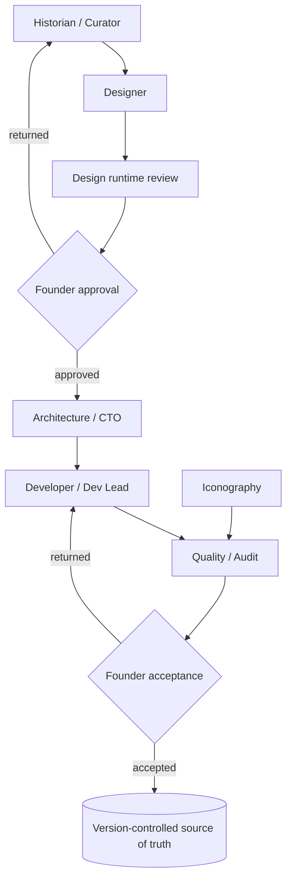

# AI operating model

Specialised AI roles under human authority. Agents propose and produce; humans hold the approval
and acceptance gates and the source of truth. A role is a scope of work, not a grant of authority.

**Boundaries.** Agents may not publish verified claims, change governance, create agents,
redefine architecture, or approve releases. Verification is always performed outside the agent
that produced the work.
