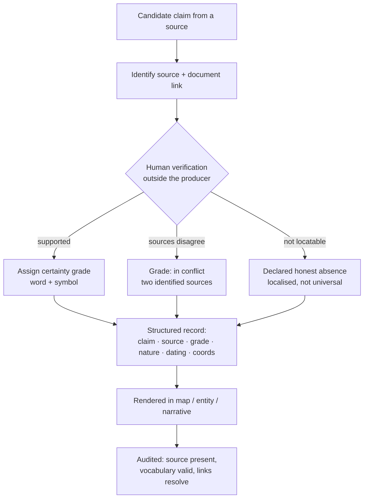

# Content verification flow

How a single claim moves from a source to a rendered, graded statement — or to an honest gap.

**Two axes, never fused.** The *grade of the claim* and the *nature/dating of the source* are
recorded and shown separately. **Prove the instrument** before declaring any absence.
