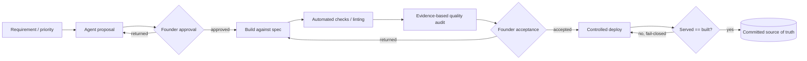

# Delivery / quality flow

From requirement to a verified, committed live state, with quality gates and a fail-closed
deploy check.

**Rules.** Single writer per file, serialised. Reviewed ≠ committed. A check that exists but is
not run on a cadence is a document, not an instrument.
