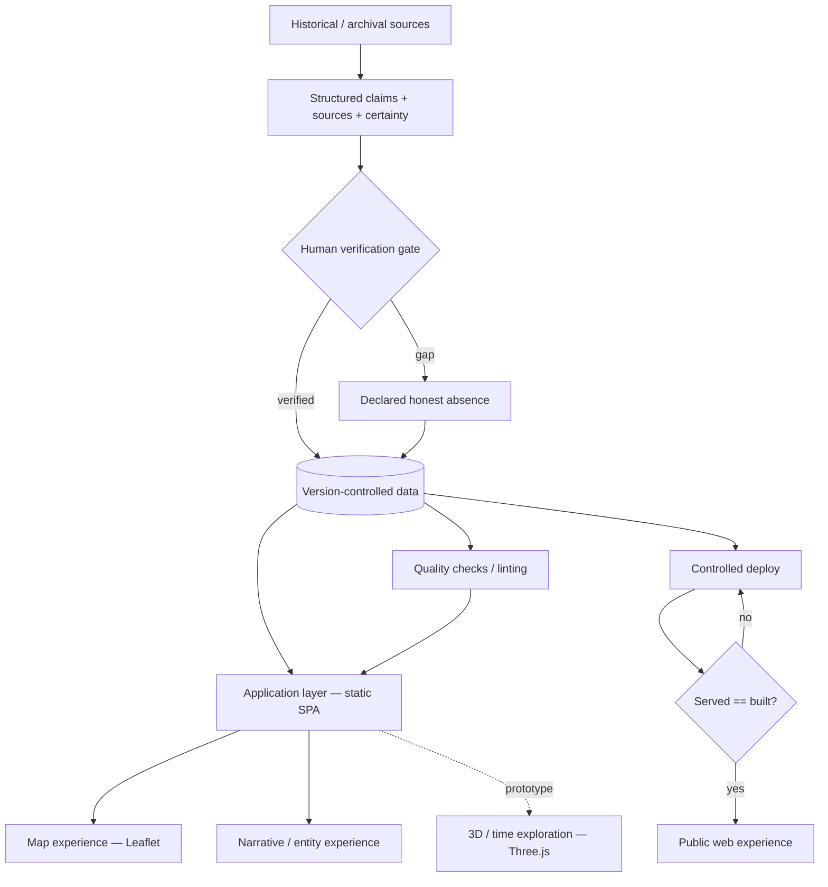

# System architecture

Static-first, data-driven. Sources become structured claims; claims pass a human verification
gate; verified data is version-controlled and rendered by a framework-free application into map,
narrative, and (prototype) 3D experiences. Quality checks run against the data; deployment is
verified served-vs-built.

**Notes.** No backend, no database, no runtime AI. 3D is a prototype, not integrated. The
served-vs-built check is fail-closed: a release is not "live" until it passes.
