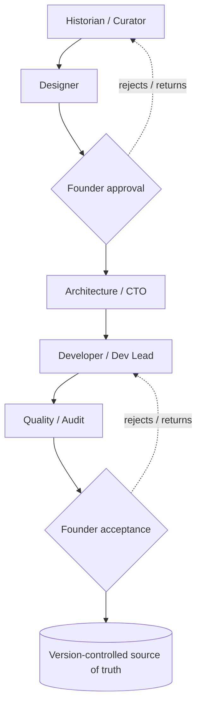

# AI operating model

Orbe is built with an **AI-assisted delivery model** organised as specialised roles under human
authority. The design goal is to gain the leverage of AI-assisted production **without** ceding
the things that make the product trustworthy: verification, governance, and release authority.

A **role is a scope of work, not a grant of authority.**

## Roles

| Role | Produces | Never does |
|---|---|---|
| **Founder / Product Lead** (human) | Vision, priorities, requirements, acceptance | — (holds final authority) |
| **Historian / Curator** (agent) | Sourced research drafts, candidate claims, declared gaps | Publish, stamp "verified", write the live product |
| **Lead Designer** (agent) | Design specs and mock-ups in the house style | Change data, ship to production, approve release |
| **Design review / runtime eye** (agent) | Live perception review of built views (proportion, legibility, themes, mobile) | Decide design, edit code, approve release |
| **Architecture / CTO** (agent) | Technical framing, schema and constraint proposals | Override governance, approve release |
| **Developer / Dev Lead** (agent) | Implementation of approved specs | Publish claims, change governance, create agents |
| **Quality / Audit** (agent) | Evidence-based audits and mechanical fixes with proof | Verify historical truth, decide schema, deploy |
| **Iconography** (agent) | Image-provenance forensics (reverse-image, source pages) | Decide attribution, write the live product |

These roles are described here at the level of the **operating model**. The internal role
instructions themselves are proprietary and are **not** reproduced in this public repository.

## Flow

## What agents may and may not do

**May** — propose, analyse, research, draft, produce candidate work, run mechanical checks, and
report findings with evidence.

**May not**, under any framing:

- publish verified historical claims
- change governance rules
- create new agents or expand the roster
- redefine the architecture
- approve the final release

## Two principles that keep it honest

1. **Verification lives outside the producer.** The agent that drafts a claim is never the agent
   (or human) that verifies it. Independence is measured on the axis that matters — three checks
   that share one blind spot are one check repeated three times.
2. **A capability is not an authorisation.** That an agent *can* perform an action (it has the
   tools, the access, the key) does not mean it *may*. The act of publishing is a human hand,
   under an explicit go and defined conditions.

## Why this matters professionally

This is an operating model for **governed, AI-assisted delivery**: it captures the leverage of
multiple specialised agents while keeping truth, scale, and release authority in human hands. It
is directly transferable to any setting where AI accelerates production but trust and
accountability cannot be delegated.
