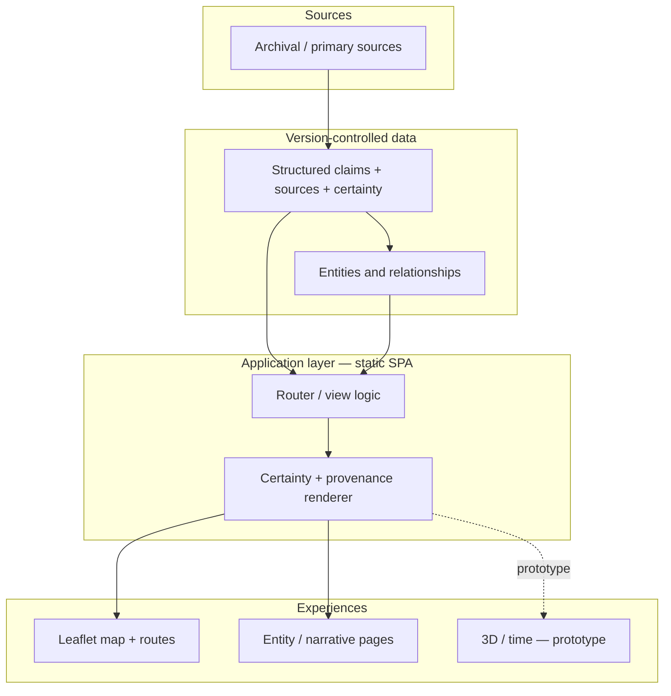

# Architecture

Orbe da Memória is a **static-first, data-driven web platform**. The public experience is
vanilla HTML/CSS/JavaScript that reads version-controlled JSON. There is no backend, no database,
and no AI at runtime. This is a deliberate architectural stance, not a limitation.

## Why static-first

- **Small trust surface.** No server-side execution and no runtime model means the public site
  cannot invent a claim. Everything shown is data that a human approved and committed.
- **Auditable data.** Because content is JSON in Git, every change to a claim, a source, or a
  certainty grade has an author, a diff, and a history.
- **Operational simplicity.** Static assets are cheap, fast, and easy to host and cache.
- **Longevity.** A digital-humanities artefact should outlive its framework churn; plain files
  age well.

## Layers

### Data layer

Structured JSON records are the source of truth for the public experience. The important records
carry, per claim: the **claim text**, a **source** (traceable to a document), a **certainty
grade**, the **nature of the source** and its **dating** (two independent axes), and — for places
and events — **coordinates** with their own certainty state. Entities (people, places, concepts)
exist once and are referenced across collections, forming a knowledge network rather than a set
of silos.

A sanitised, illustrative record is provided in
[../examples/structured-content-example.json](../examples/structured-content-example.json).

### Application layer

A small, framework-free single-page application renders views from the data. A dedicated
rendering path turns the certainty and provenance fields into a consistent visual language —
**word plus symbol, never colour alone** — so the same claim reads the same way in a map card, an
entity page, and a source list.

### Experience layer

- **Map** (Leaflet, production): a contextual map that activates in response to user intent and
  can draw historical routes. It is a reactive surface for exploration, not a static catalogue.
- **Entity / narrative** (production): figures and places as interlinked pages, each claim shown
  with its grade and source.
- **3D / temporal** (Three.js, **prototype**): a globe and an immersive journey reader that live
  in a lab and are **not integrated** into the production product. They are evaluated separately
  from the question of whether and how to integrate them.

## Deployment

Deployment is **controlled and manual**, to managed web hosting, over SSH. There is no CI/CD in
the production path. Two disciplines make this safe:

- **Served == built.** After every deploy, the served bytes are fetched and proven identical to
  the built bytes, and that result is recorded against the release. A deploy is not "done" until
  this passes.
- **Cache-busting is explicit.** Asset versions are bumped deliberately so returning visitors
  receive updated data and code, not stale caches.

Hosts, paths, credentials, and scripts are intentionally excluded from this public case study.

## Constraints that shaped the design

- **Truth over volume.** The architecture is optimised for defensible claims, not for maximum
  content throughput.
- **Human verification outside the producer.** The system is arranged so that whoever (or
  whatever) produces a claim is never the one who verifies it.
- **Honest absence.** A missing source or coordinate is rendered as a stated gap, which required
  first-class "absence" states in the data model rather than empty fields.

## Architecture as a governed decision

These are **target-model decisions**, not defaults. Static-first, version-controlled data, and no
runtime AI were chosen for a small trust surface, auditable state, and longevity — each with a
recorded trade-off in [technical-decisions.md](technical-decisions.md). That recorded reasoning,
with an author and a history, is what makes the architecture *governed* rather than merely
implemented. The information-systems-governance reading is in [is-governance.md](is-governance.md).
