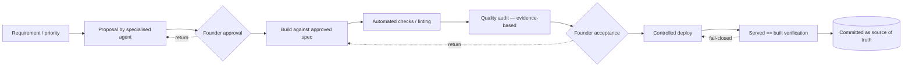

# Delivery model

How work moves from idea to a verified, live state — and how quality is enforced along the way.

## Delivery flow

## Principles

- **Single writer, serialised.** Each file has an owner; handing a task to another producer
  requires an explicit stand-down from the previous one. This avoids two producers colliding on
  the same artefact.
- **Cotejado ≠ committed.** Reviewing a change and landing it are two acts. Nothing is described
  as "shipped" until the commit shows it.
- **Whoever lets go, leaves the repo clean.** The producer clears its own temporary state before
  handing over.
- **A deploy proves itself.** Post-deploy, the served bytes are checked against the built bytes,
  fail-closed. An empty check that "passes" is worse than no check.

## Quality checks derived from data state

Readiness is computed from the data, not declared by hand. Representative checks:

- every claim has a source;
- certainty grades conform to the sealed vocabulary;
- coordinates carry an explicit state (candidate vs audited);
- entity/relationship references resolve (no dangling links);
- source-to-document links are well-formed (and, on cadence, reachable);
- public text is free of internal jargon.

Checks run on a **cadence** and before publication. The rule that keeps them honest: *a check that
exists but is not run on a cadence is a document, not an instrument* — so a new check joins the
cadence in the same change that introduces it.

## Hand-off discipline

Because delivery spans specialised roles, a hand-off is only complete when it is **durably
recorded** (state, files touched, evidence, next step), **communicated** to the next owner, and
**acknowledged** where there is a real dependency. Writing it down is not the same as informing
someone; both are required.

## The readiness principle

> Readiness should be *derived from real data state*, not manually asserted.

This is why quality lives in instruments and in committed state, not in status meetings. It is
also what makes the project's status claims (in production / in development / prototype / planned)
checkable rather than aspirational.

## Delivery as IT transformation

Read as a transformation, this is a move **from discipline to instruments** — hand-checking becomes
controls derived from data state — and **from ad-hoc change to governed release**, where a deploy is
not done until served-vs-built proof passes, fail-closed. The transferable operating-model reading
is in [is-governance.md](is-governance.md).
