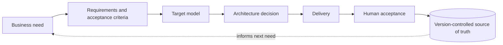

# Information-systems governance & transformation

This document reads Orbe da Memória through one lens: **how an information system and its
AI-assisted delivery are governed.** Nothing here is a new capability invented for the case study.
It is the same operating model described elsewhere in this repository —
[governance.md](governance.md), [delivery-model.md](delivery-model.md),
[ai-operating-model.md](ai-operating-model.md), [architecture.md](architecture.md) — named in the
vocabulary of information-systems governance and transformation.

## Scope, stated honestly

- This is demonstrated at the scale of a **founder-led product**, not an enterprise or a
  public-sector programme.
- It is offered as a **transferable operating model** — a way of running information systems and
  AI-assisted delivery under explicit governance — because the disciplines, not the headcount, are
  what transfer.
- It does **not** claim a title such as enterprise architect, urbaniste SI, or head of IS, and it
  does not claim delivery experience the product does not contain.

The point is narrow and defensible: the same person set the requirements, chose the target model,
made the architecture decisions, governed an AI-assisted delivery system, and kept the result
auditable — end to end, on a live product.

## The governed value chain

Every unit of work travels the same line, with a human decision holding each end — the business
intent at the start, and acceptance into a versioned source of truth at the finish.

## Information-systems governance, discipline by discipline

### Single source of truth
State lives in version-controlled source, not in conversations. A decision is **durable only when
it is both approved and written into the repository** — approval that lives only in a chat is not
durable, because it will be forgotten or contradicted. "Done" is therefore a state with an author,
a diff, and a history, not a message.

### Decision rights
Who may decide what is explicit. A *role is a scope of work, not a grant of authority*: agents (and
producers generally) may propose, analyse, and build; they may not change governance, redefine the
architecture, expand the delivery system, or approve a release. Those rights stay with the founder.

### Separation of duties
Verification is performed **outside** the party that produced the work. The agent that drafts a
claim is never the one that verifies it, and independence is measured on the axis that matters —
three checks that share one blind spot are one check repeated three times.

### Data governance
Every public claim carries a **source** and an explicit **certainty grade**, expressed as word plus
symbol rather than colour or a false percentage. The grade of a claim and the nature/dating of its
source are kept as two axes and never fused. Missing data renders as a **stated gap**, not a blank
or a confident guess — an honest absence is itself an assertion, and is proven as one.

### Control by instrument, not by discipline alone
Readiness is **derived from data state**, not declared by hand. Checks — source present for every
claim, certainty vocabulary conformance, coordinate state, link integrity — run on a cadence and
before publication. The rule that keeps them honest: *a check that exists but is not run on a
cadence is a document, not an instrument*, so a new check joins the cadence in the same change that
introduces it. Controls report; humans decide.

### Release governance
A release proves itself. After every deploy, the **served bytes are proven identical to the built
bytes** and the result is recorded against the release, fail-closed. "Live" is a verified state,
not a claim — the governance equivalent of a change that is not closed until it is validated in
production.

## Governed AI transformation

The harder half of the model is adopting AI-assisted delivery **without** losing the things that
make an information system trustworthy. Orbe does this with two rules that generalise well beyond
this product:

- **A capability is not an authorisation.** That an agent *can* act — it has the tools, the access,
  the key — does not mean it *may*. Publishing is a human hand under an explicit go.
- **Verification lives outside the producer.** Leverage is taken from specialised agents up to each
  gate; the gates do not move because the engine got faster.

This is the reusable answer to the question every organisation now faces — *how do we get AI's
throughput without delegating accountability?* Here it is answered concretely, on a running system,
rather than as policy on a slide.

## IT transformation reading

The same model is a small, complete transformation story: a move **from discipline to instruments**
(hand-checking replaced by controls derived from data state), **from prose to a target model**
(narrative rendered from a structured schema rather than authored loose), and **from ad-hoc change
to governed release** (controlled deployment with served-vs-built proof). The architecture choice
that carries it — static-first, version-controlled data, no runtime AI — is a deliberate target
model chosen for a small trust surface, auditability, and longevity, with its trade-offs recorded
in [technical-decisions.md](technical-decisions.md).

## What this is not

- Not a claim of enterprise or public-sector scale, budget authority, or team leadership beyond a
  founder-led product.
- Not a completed digital-humanities interoperability implementation — that remains a designed-
  toward, planned track (see [roadmap.md](roadmap.md)).
- Not a statement that the 3D/temporal prototype is in production — it is a lab prototype, not
  integrated.
- Not a substitute for the private production repository, which stays the source of truth and was
  read only to produce this sanitised case study.

> The claim is modest and exact: one person governed an information system and an AI-assisted
> delivery model end to end, and left the result auditable. The model is what transfers.
